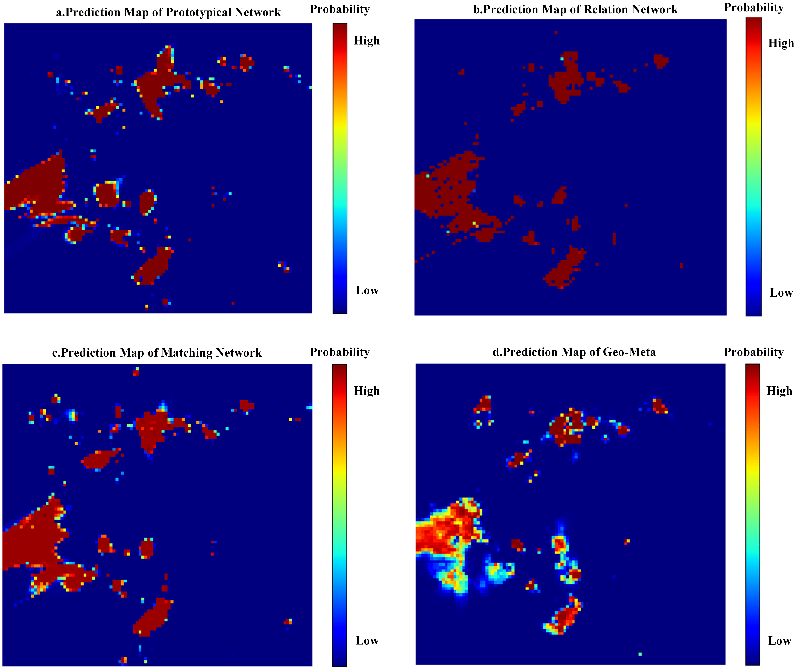

# Mineral Prediction Based on Prototype Learning
To implement the steps described in the paper, follow the instructions below to prepare your dataset and run the code:
## 1. Training: train_GeoMeta.py
This is the training code for the proposed Geo-Meta model as described in the paper. Before running this code, you need to perform the following preparation steps:
### Step 1: Prepare your dataset
The "tools" folder contains several utility functions, including "loadTifImage.py" (which is used to read multi-channel Tif format data in PyTorch), "split_data.py" (which splits the Tif format data of the study area into square samples using a sliding window algorithm and assigns them to their respective classes based on known coordinates of each type of mineral deposit), "train_val_test_split.py" (which handles the split of training and testing datasets), and "class_indices.json" (a predefined index file that maps class labels to their corresponding indices in the dataset). After preparing your dataset (converting raster data to Tif format using ArcGIS), run the "split_data.py" file to segment the study area data and construct the dataset. Then, run the "train_val_test_split.py" file to split the data into training and testing sets.
### Step 2: Convert image-based dataset to graph-based dataset
Once you have prepared your dataset, run the "image2graph.py" function. This function uses algorithms such as superpixel segmentation to define the eight neighboring points around each pixel (see code comments for details). It converts the image-based dataset to a graph-based dataset, linking them based on the file names. In other words, to find the corresponding graph data for a specific image data point, you can search for the file with the same name in the converted graph-based dataset. This allows you to convert the image-based training and testing data to graph-based format, which can be saved in the .pt format.
### Step 3: Pretrain the VAE-GAN and create an unlabeled anomalous sample pool
To fine-tune the prototype using the anomaly data generated by VAE-GAN, we need to build an unlabeled anomalous sample pool before training Geo-Meta. Run the "pretrain_vaegan.py" file to pretrain the VAE-GAN. Then, based on the anomaly score of each sample, retain the highly anomalous samples to form the unlabeled anomalous sample pool.
### Step 4: Training the Geo-Meta model
After completing the above steps, make the necessary modifications to the "train_GeoMeta.py" file according to your own dataset, as indicated in the comments. Then, run the code to train the Geo-Meta model.
## 2. Testing and Evaluation: "evaluation" folder
The "evaluation" folder contains functions for testing the performance of the trained models. It includes generating prediction heatmaps, ROC curves, and PA (Prediction Area) plots. To generate an ROC curve, modify the relevant configurations according to the comments in the code and run "ROC.py". If you want to generate prediction heatmaps, follow these two steps: first, run "createNumpyData.py" to feed each sample into the pre-trained model and save the model's output (the probability of containing mineral deposits for each sample) as a numpy file; second, run "createHeatingImg.py" to generate the heatmaps based on the saved numpy file. To generate a PA plot, modify the relevant configurations according to the comments in the code and run "PAimage.py".
## 3. Baseline Methods: "baselines" folder
The "baselines" folder contains training codes for several baseline methods, including Prototypical Network, Relation Network, and Matching Network. Simply modify the relevant configurations as indicated in the comments and run the respective code for each method.
## 4. Model Weights : "saved_model" folder
The "saved_model" folder contains the weights of the feature extractor of the trained models and the learned prototypes vectors for five classes. We have saved the best epoch of all models during the training process, with the specific format as follows:

"geometa-ACC_byDL_0.9657.pth": The weights of the feature extractor for the Geo-Meta model correspond to a best accuracy of 0.9657.

"geometa-support_ACC_byDL_0.9657.pt": The Geo-Meta model has learned prototype vectors for five classes, with a corresponding best accuracy of 0.9657.
## 5. Generate Prediction Heatmaps : "numpyData" folder
The "numpyData" folder contains numpy data files for the probability of mineral occurrence at each location in the study area, as predicted by all models, with the specific format as follows:

"Geo-Meta_Hydrothermal_img.npy" : The probability of each grid sample in the study area belonging to the "Hydrothermal" category.

"Geo-Meta_Porphyry_img.npy" : The probability of each grid sample in the study area belonging to the "Porphyry" category.

"Geo-Meta_Skarn_img.npy" : The probability of each grid sample in the study area belonging to the "Skarn" category.

"Geo-Meta_Volcano_img.npy" : The probability of each grid sample in the study area belonging to the "Volcano" category.

Since our data is confidential, you can generate prediction heatmaps based on these npy files by running the "createHeatingImg.py" file. If you want to view the prediction results of different networks, simply modify the corresponding file paths in the "createHeatingImg.py" file.

